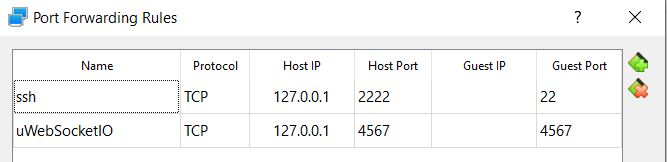

# Project: End to End Self-Driving Car Software

[](http://www.udacity.com/drive)

This Robotics Deep Learning application safely maneuvers a car around a virtual highway while stopping at red traffic lights by using perception, path planning and control modules through system integration. 


Check out my youtube video [End to End Self-Driving Car Application Demo]() on testing the car to drive around the virtual highway while stopping at red traffic lights for 1 lap.

Overview
---

The purpose of this project was to implement a perception, path planning and control subsystem in Python within the current software infrastructure for an End to End Self-Driving Car Robotics application provided by Udacity. In this project, I learned to write ROS nodes to implement core functionality of the autonomous vehicle system, which included traffic light detection, control and waypoint following. For the next part of the project, I tested my code using Udacity's System Integration Simulator. Once the car drove safely around the virtual highway and stopped at red stop lights, as an individual I finished the capstone project. Alternatively, if one forms a team, then after they finish testing their code in the simulator, then as a group, they can submit their project to be run on Carla. Carla is Udacity's real self-driving car. However, I decided to submit my project as an individual, so I will be walking you through the steps to get the car driving safely only in the simulator. 

Contents
---

**TODO: Finish Contents**

- **[src/](src/)**: contains source code for the project
- **[src/main.cpp](src/main.cpp)**: main file is executed after running **./run.sh** shell script. main.cpp acts as a web server that reads crosstrack error and speed data from the simulator client. Then it processes that data to calculate the steering angle and throttle, which is passed as a JSON message to the simulator to control the car's steering and speed.
- **[docs](docs)**: contains images, backup code and research papers
- **[build.sh](build.sh)**: creates build directory, compiles the project into an executable file **pid**
- **[run.sh](run.sh)**: executes the **pid** program
- **[clean.sh](clean.sh)**: removes the build folder and cleans the project
- **[install-ubuntu.sh](install-ubuntu.sh)**: contains bash code to install the tools necessary to run the PID project on linux. This script can be run inside Windows 10 Bash on Ubuntu. There is a similar install script for mac.
- **[CMakeLists.txt](CMakeLists.txt)**: contains directives and instructions describing the project's source files and targets (executable, library, or both). It is a build configuration file that cmake uses to generate makefiles. Then the make command is used to manage compiling the project, use a compiler to compile the program and generate executables. In our case, we retrieve the **pid** executable file, machine language, that runs the c++ program directly on the computer.

Reflection
---

**TODO: Finish Reflection**


Setup Software Development Environment for Project
---

### Recommended VM Install: Udacity Ubuntu 16.04 VM Development Environment

1\. The recommended approach by the instructors of this project is to download [Udacity's Ubuntu 16.04 virtual machine](https://s3-us-west-1.amazonaws.com/udacity-selfdrivingcar/Udacity_VM_Base_V1.0.0.zip) that comes with ROS, Dataspeed DBW and other software installed to resemble as closely as possible the softare environment of Carla. Carla is Udacity's real self-driving car.

The virtual machine will require port forwarding to Udacity's simulator port, the image below shows an example of the port forwarded for uWebSocketIO in Virtualbox:



If you install Udacity's VM, you can skip the alternative installs and jump to **Udacity System Integration Simulator**. Its recommended that you download the simulator onto your host machine outside of the simulator for best performance.

### Alternative 1 Native Install: Ubuntu 16.04 Development Environment

Alternatively, you could natively install the software development environment to resemble the development environment of Carla.

1\. Minimum Hardware Specifications: **2 CPU**, **2 GB system memory**, **25GB of free hard drive space**

2\. Your workstation must be running **Ubuntu 16.04** Xenial Xerus. [Link to Ubuntu Downloads](https://www.ubuntu.com/download/desktop)

3\. Install [ROS Kinetic](http://wiki.ros.org/kinetic/Installation/Ubuntu) for Ubuntu 16.04

4\. Install [Dataspeed DBW](https://bitbucket.org/DataspeedInc/dbw_mkz_ros). **Note:** DBW is a **dbw_mkz** ROS package, so feel free to look up how to install it with ROS once ROS is already installed.

### Alternative 2 Docker Install: Ubuntu 16.04 Development Environment

Alternatively, you could install Docker and build Udacity's Docker image, which is similar to Udacity's Virtual Machine environment, but uses Docker instead.

1\. [Install Docker](https://docs.docker.com/engine/installation/)

2\. Build the Docker image from Udacity's Dockerfile

~~~
git clone https://github.com/udacity/CarND-Capstone
cd path/to/CarND-Capstone
docker build . -t capstone
~~~

3\. Deploy a Docker container from the Docker image

~~~
docker run -p 4567:4567 -v $PWD:/capstone -v /tmp/log:/root/.ros/ --rm -it capstone
~~~

### Udacity System Integration Simulator

This project requires the **Udacity System Integration Simulator**, which can be downloaded from this [GitHub Link: System Integration v1.3](https://github.com/udacity/CarND-Capstone/releases). Note: If you developing the self-driving car software in a virtual machine, it is recommended that you download Udacity's simulator on your host machine.

Dependencies for Running Project Demo
---

* cmake >= 3.5
 * All OSes: [click here for installation instructions](https://cmake.org/install/)
* make >= 4.1(mac, linux), 3.81(Windows)
  * Linux: make is installed by default on most Linux distros
  * Mac: [install Xcode command line tools to get make](https://developer.apple.com/xcode/features/)
  * Windows: [Click here for installation instructions](http://gnuwin32.sourceforge.net/packages/make.htm)
* gcc/g++ >= 5.4
  * Linux: gcc / g++ is installed by default on most Linux distros
  * Mac: same deal as make - [install Xcode command line tools]((https://developer.apple.com/xcode/features/)
  * Windows: recommend using [MinGW](http://www.mingw.org/)
* [uWebSockets](https://github.com/uWebSockets/uWebSockets)
  * Run either `./install-mac.sh` or `./install-ubuntu.sh`.
  * If you install from source, checkout to commit `e94b6e1`, i.e.
    ```
    git clone https://github.com/uWebSockets/uWebSockets 
    cd uWebSockets
    git checkout e94b6e1
    ```

How to Run Demo
---

**TODO: Finish How to Run Demo**

Train SSD MobileNet v1

~~~bash
python train.py \
--logtostderr \
--train_dir=./tensorflow/models/train/ssd_mobilenet/ssd_mobilenet_v1_tl /
--pipeline_config_path=./config/ssd_mobilenet_v1_coco.config

python export_inference_graph.py \
--input_type=image_tensor \
--pipeline_config_path=./config/ssd_mobilenet_v1_coco.config \
--trained_checkpoint_prefix=./tensorflow/models/train/ssd_mobilenet/ssd_mobilenet_v1_tl/model.ckpt-2000 \
--output_directory=./tensorflow/models/output/trained/ssd_mobilenet/ssd_inception_v1_tl/
~~~

Train SSD Inception V2

~~~bash
python train.py \
--logtostderr \
--train_dir=./tensorflow/models/train/ssd_inception/ssd_inception_v2_tl /
--pipeline_config_path=./config/ssd_inception_v2_coco.config

python export_inference_graph.py \
--input_type=image_tensor \
--pipeline_config_path=./config/ssd_inception_v2_coco.config \
--trained_checkpoint_prefix=./tensorflow/models/train/ssd_inception/ssd_inception_v2_tl/model.ckpt-2000 \
--output_directory=./tensorflow/models/output/trained/ssd_inception/ssd_inception_v2_tl/

2773: loss = 1.7590

model.ckpt-2773

4597: loss = 1.9408

4683 in 2 hours: loss = 2.02

4424: loss = 1.9900

model.ckpt-4424conda
~~~

Conclusion
---

Congratulations! You just ran the demo for an End to End Self-Driving Car software application with a Unity simulator. We followed waypoints on the virtual highway using the Path Planner, recognized red traffic lights using Traffic Light Classification, adjusted the car's brake, speed and steering using a Twist Controller. By performing system integration to integrate the vehicle subsystems: perception, path planning and control, the car was able to drive safely around the virtual highway and stop at traffic lights if they are red else the car keeps going. The result was that the car was able to drive safely around the virtual highway through all 8 traffic light intersections while stopping when needed. The most challenging part of the project was tuning the ROS software system to minimize camera latency coming from the Unity simulator. The camera data was needed, so we could use our traffic light classifier to detect and classify traffic light state, allowing the car to know when to stop at a traffic light. So, the speed of camera image dataflow between the ROS system and the simulator was critical, so the car could make timely stops at traffic lights that would be safe along with driving safe on the virtual highway. With the proper tuning to the ROS system discussed in the reflection earlier, I was able to get rid of most of lag in the simulator. The other most challenging part of the project was working with multiple different versions of Tensorflow on my local laptop. Since I had limited time to finish this project, I decided to work on it as an individual and mainly focus on getting the car to drive safely in the virtual environment. If I had more time, I would have formed a team and tested my ROS software on Udacity's real self-driving car to see if it drove safely in their real test environment.

Resources
---

- Udacity SDCE-ND: Autonomous Vehicle Curriculum
    - Course 1: Computer Vision
    - Course 2: Deep Learning
    - Course 3: Sensor Fusion
    - Course 4: Localization
    - Course 5: Path Planning
    - Course 6: Control
    - Course 7: System Integration
    - Course X: Additional Content
      - Lesson 1: Object Detection

- Helpful GitHub Repositories
  - [alex-lechner: Traffic Light Classification](https://github.com/alex-lechner/Traffic-Light-Classification)
  - [josehoras: Capstone: Program an Autonomous Vehicle](https://github.com/josehoras/Self-Driving-Car-Nanodegree-Capstone)
  - [Tensorflow Object Detection API](https://github.com/tensorflow/models/tree/master/research/object_detection)
  - [Protocol Buffers v3.4.0](https://github.com/protocolbuffers/protobuf/releases/tag/v3.4.0) needed for Windows 10!

- Blog Posts
  - [Installing TensorFlow Object Detection API on Windows 10](https://medium.com/@marklabinski/installing-tensorflow-object-detection-api-on-windows-10-7a4eb83e1e7b)

- Helpful GitHub Issues
  - [Tensorflow Object Detection API on Windows - error "MobuleNotFoundError: No module named 'utils'"](https://github.com/tensorflow/models/issues/3164)


This is the project repo for the final project of the Udacity Self-Driving Car Nanodegree: Programming a Real Self-Driving Car. For more information about the project, see the project introduction [here](https://classroom.udacity.com/nanodegrees/nd013/parts/6047fe34-d93c-4f50-8336-b70ef10cb4b2/modules/e1a23b06-329a-4684-a717-ad476f0d8dff/lessons/462c933d-9f24-42d3-8bdc-a08a5fc866e4/concepts/5ab4b122-83e6-436d-850f-9f4d26627fd9).

Please use **one** of the two installation options, either native **or** docker installation.

### Native Installation

* Be sure that your workstation is running Ubuntu 16.04 Xenial Xerus or Ubuntu 14.04 Trusty Tahir. [Ubuntu downloads can be found here](https://www.ubuntu.com/download/desktop).
* If using a Virtual Machine to install Ubuntu, use the following configuration as minimum:
  * 2 CPU
  * 2 GB system memory
  * 25 GB of free hard drive space

  The Udacity provided virtual machine has ROS and Dataspeed DBW already installed, so you can skip the next two steps if you are using this.

* Follow these instructions to install ROS
  * [ROS Kinetic](http://wiki.ros.org/kinetic/Installation/Ubuntu) if you have Ubuntu 16.04.
  * [ROS Indigo](http://wiki.ros.org/indigo/Installation/Ubuntu) if you have Ubuntu 14.04.
* [Dataspeed DBW](https://bitbucket.org/DataspeedInc/dbw_mkz_ros)
  * Use this option to install the SDK on a workstation that already has ROS installed: [One Line SDK Install (binary)](https://bitbucket.org/DataspeedInc/dbw_mkz_ros/src/81e63fcc335d7b64139d7482017d6a97b405e250/ROS_SETUP.md?fileviewer=file-view-default)
* Download the [Udacity Simulator](https://github.com/udacity/CarND-Capstone/releases).

### Docker Installation
[Install Docker](https://docs.docker.com/engine/installation/)

Build the docker container
```bash
docker build . -t capstone
```

Run the docker file
```bash
docker run -p 4567:4567 -v $PWD:/capstone -v /tmp/log:/root/.ros/ --rm -it capstone
```

### Port Forwarding
To set up port forwarding, please refer to the "uWebSocketIO Starter Guide" found in the classroom (see Extended Kalman Filter Project lesson).

### Usage

1. Clone the project repository
```bash
git clone https://github.com/udacity/CarND-Capstone.git
```

2. Install python dependencies
```bash
cd CarND-Capstone
pip install -r requirements.txt
```
3. Make and run styx
```bash
cd ros
catkin_make
source devel/setup.sh
roslaunch launch/styx.launch
```
4. Run the simulator

### Real world testing
1. Download [training bag](https://s3-us-west-1.amazonaws.com/udacity-selfdrivingcar/traffic_light_bag_file.zip) that was recorded on the Udacity self-driving car.
2. Unzip the file
```bash
unzip traffic_light_bag_file.zip
```
3. Play the bag file
```bash
rosbag play -l traffic_light_bag_file/traffic_light_training.bag
```
4. Launch your project in site mode
```bash
cd CarND-Capstone/ros
roslaunch launch/site.launch
```
5. Confirm that traffic light detection works on real life images

### Other library/driver information
Outside of `requirements.txt`, here is information on other driver/library versions used in the simulator and Carla:

Specific to these libraries, the simulator grader and Carla use the following:

|        | Simulator | Carla  |
| :-----------: |:-------------:| :-----:|
| Nvidia driver | 384.130 | 384.130 |
| CUDA | 8.0.61 | 8.0.61 |
| cuDNN | 6.0.21 | 6.0.21 |
| TensorRT | N/A | N/A |
| OpenCV | 3.2.0-dev | 2.4.8 |
| OpenMP | N/A | N/A |

We are working on a fix to line up the OpenCV versions between the two.

How To Run Demo
---
